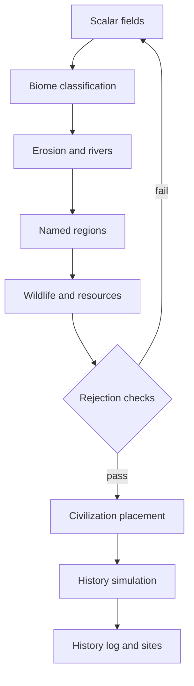

# Dwarf Fortress — terrain generation research

Conceptual comparison for World Builder **landmass** design. Not a code port, graphics reference, or style guide.

- Epic: [#293](https://github.com/enmaku/portfolio-site/issues/293)
- Glossary: [`../CONTEXT.md`](../CONTEXT.md)
- Logistics-first constraints: Worldbuilding Insights playlist (see [`README.md`](./README.md))

## Scope and sources

**Goal:** Understand how Dwarf Fortress (DF) produces believable geography and history, and what World Builder should adopt, extend, or skip.

**Sources used:**

| Source | What it provides |
| --- | --- |
| [Qartar/dwarf-fortress](https://github.com/Qartar/dwarf-fortress) (legacy branch) | Public **`data/init/world_gen.txt`** parameter sets — not readable generation source |
| [Dwarf Fortress Wiki — Advanced world generation](https://dwarffortresswiki.org/Advanced_world_generation) | Documented phases, rejection tokens, seed behavior |
| [Gamasutra interview with Tarn Adams (2008)](https://www.gamedeveloper.com/design/interview-the-making-of-dwarf-fortress) | Field-first terrain, erosion, rivers, regions |
| [Game AI Pro 2, ch. 41 — Simulation Principles from Dwarf Fortress](http://www.gameaipro.com/GameAIPro2/GameAIPro2_Chapter41_Simulation_Principles_from_Dwarf_Fortress.pdf) | Four design principles for procedural simulation |
| [Q&A with Tarn Adams (Game Developer)](https://www.gamedeveloper.com/design/q-a-dissecting-the-development-of-i-dwarf-fortress-i-with-creator-tarn-adams) | History as zero-player strategy simulation |

**Important:** The GitHub repo is an unofficial mirror of **binary releases** plus config. DF’s C++ source is not public. Algorithm detail here comes from developer interviews and wiki documentation, not from reading implementation code.

## DF world creation — two phases

DF splits creation into **physical world** then **history simulation**. World Builder follows the same high-level split: **landmass** → culture / settlement / conflict → **history log**.



### Phase 1 — Physical terrain

DF explicitly rejects painting biomes first (“lay down forests, then deserts…”). Toady Adams: go to **basic elements**; biomes **arise** from overlapping fields.

**Scalar fields generated (continental map):**

| Field | Role |
| --- | --- |
| Elevation | Midpoint-displacement fractal; low tiles → ocean |
| Temperature | Fractal, biased by latitude and elevation |
| Rainfall | Fractal, then **orographic precipitation** and rain shadows |
| Drainage | Fractal; low → swamps/lakes, high → hills |
| Volcanism, savagery | Extra classification axes |
| Salinity | Oceans at 100, tapering inland |

Biomes are **derived** from field overlap (e.g. high rainfall + low drainage → swamp). Boundaries look natural because they emerge from continuous rasters, not hand-placed labels.

**Hydrology as post-process:**

1. Temporary rivers carve from mountain bases toward ocean (erosion wears peaks).
2. Permanent rivers follow carved channels; missing paths forced; lakes added.
3. Tributaries, flow amounts, and names computed.

Rivers are **geographic** haul edges in DF — not bulk **ox paradox** economics.

**Named regions:** Connected biome groups become named regions (e.g. one forest name spanning taiga in the north and jungle in the south if contiguous). Culture and politics attach to **regions**, not only per-tile biomes.

**Rejection sampling:** After parameters shape a candidate world, DF **discards** it if constraints fail — minimum biome counts, peaks, river heads, civ prerequisites, etc. (`REGION_COUNTS`, `RIVER_MINS`, … in `world_gen.txt`). Worlds can be rejected many times before one passes. Same *philosophy* as World Builder validation checks (population ceiling, impossible capitals), but DF quotas are biome-oriented; ours are **logistics-oriented**.

### Phase 2 — History simulation

After terrain verification, DF places civilizations and runs a **zero-player strategy game** — many agents, loose turns, imperfect AI. The **history log records simulation**, not an authored timeline. Settlements, trade routes, and wars **emerge**.

Controls include `END_YEAR`, `SITE_CAP`, `TOTAL_CIV_NUMBER`, and triggers that halt history early (e.g. megabeast elimination thresholds).

**Separate seeds:** `WORLD_SEED` vs `HISTORY_SEED` — same geography can replay with different events. Matches World Builder’s **geography seed** / **history seed** split in the **world document**.

**Caveat from Toady:** Without enough dynamics, output gets boring; highlights need post-processing or investigation.

## DF design principles (Game AI Pro ch. 41)

1. **Don’t overplan — iterate.** Run a pipeline early; tune from output.
2. **Break down to basic elements.** Fields → biomes → hydrology → regions, not “generate a kingdom map.”
3. **Don’t overcomplicate.** Only simulate variables downstream systems consume.
4. **Base on real-world analogs.** Rain shadows, drainage vs swamp/forest, erosion carving valleys — why DF worlds “read” without hand placement.

## World Builder vs DF — comparison

| Need | Playlist / CONTEXT | DF |
| --- | --- | --- |
| **Movement cost** graph | #13 landscape pressure | Implicit in elevation; no explicit economic field |
| **Travel time** as primary measure | #05 | Not modeled at macro scale |
| **Ox paradox / haul-shed** | #15 | Absent |
| **Drain city / maritime reach** | #16 | Coasts and rivers exist; no parasite-city economics |
| **Population ceiling / arable envelope** | #17 | Not validated at worldgen |
| **Strategic resources (salt)** | #18 | Minerals exist; no preservation-logistics layer |
| **Settlement nodes** (choke, junction, surplus, refinery) | #15 | Sites emerge from civ AI, not logistics typing |
| **Culture engine inputs** | #09, #13 | Biome → wildlife; no five-forces pressure stack |
| **Fields before labels** | Environmental pressure stack | Core DF approach ✓ |
| **Hydrology from elevation** | Haul edges, junctions | Core DF approach ✓ |
| **Rejection until coherent** | Validation checks | Core DF approach ✓ |
| **History as simulation log** | **History log**, **rivalry** | Core DF approach ✓ |

**Bottom line:** DF supplies the **geographic engine**. World Builder adds the playlist’s **logistics and political engine** on top.

## Adopt from DF

1. **Fields before labels** — elevation, climate, rainfall, drainage → biomes and resource rasters → movement cost, visibility, connectivity (see **environmental pressure stack**).
2. **Hydrology as derived graph** — erosion-then-rivers; river mouths and passes become settlement **chokepoints** and **haul junctions** in later stages.
3. **Orographic effects** — rain shadows create resource mismatch and border friction (#13, #15).
4. **Rejection sampling** — fast reject + regenerate; log reasons for tuning (DF writes `map_rejection_log.txt`).
5. **Separate geography and history seeds** — export both in the **world document**.
6. **Named contiguous regions** — **exchange** and **connectivity** differ by region cluster, not only biome tile.
7. **History pattern** — **epoch** ticks and **rivalry** with stored causes; full DF-scale agent sim is optional later, not required for v1.

## World Builder-specific (DF does not do)

**Logistics pass** after physical terrain:

- Land vs sea haul cost ratio (~40×, #16)
- **Ox paradox** decay on bulk goods (#15, #17)
- Fresh-water ceiling for urban nodes (#16)
- **Arable envelope** → **population ceiling** (#17)
- **Strategic resource** placement → salt roads and **conflict engine** wants (#18)

Settlement placement should attach to logistics **nodes** (choke, junction, surplus, refinery, **drain city**), not random dots or civ AI alone.

## Do not copy

- Good/evil, savagery, megabeast quotas — fantasy flavor unless explicitly desired
- Biome-only wildlife scatter — Toady noted geographic continuity as a weakness; **culture engine** wants regional coherence
- Unbounded rejection loops without UX — keep generation time predictable; surface rejection reasons
- Full 3D fluid/pathfinding at fortress scale — out of scope for macro **landmass**; movement **graph** is enough

## Proposed World Builder landmass pipeline

Canonical stage names live in [`../CONTEXT.md`](../CONTEXT.md) (**landmass pipeline**). This is the research-derived ordering:

```
Stage A — Scalar fields (DF-like)
  elevation, temperature, rainfall (+ rain shadow), drainage, salinity

Stage B — Derived geography (DF-like)
  biomes, erosion, river graph, lakes, coast navigability, mineral/salt nodes

Stage C — Logistics pass (WB-specific)
  movement cost, visibility, connectivity
  arable envelope, maritime reach, strategic resources
  natural threat zones

Stage D — Validation / rejection (DF pattern + WB checks)
  population ceiling, haul viability, required node presence

Stage E — Downstream consumers
  culture engine ← environmental pressure stack
  settlement placement ← logistics nodes
  conflict engine ← trade routes + strategic scarcity

Stage F — History log (DF-inspired, WB-scoped)
  epoch ticks, faction emergence, rivalry with stored causes
```

## Rejection mapping (DF pattern → WB checks)

| DF-style reject | World Builder equivalent |
| --- | --- |
| Not enough rivers | No viable haul corridors between arable zones |
| Missing biome mix | No resource-mismatch zones (interesting friction) |
| Civ cannot place | No defensible **chokepoints** where **political middle layer** forts make sense |
| — | Capital exceeds **population ceiling** |
| — | Bulk food route violates **ox paradox** without **maritime reach** |

## Research process (for future sessions)

1. Read local **CONTEXT** and playlist transcripts for logistics constraints.
2. Compare against external reference (here: DF wiki, interviews, public config — not assumed source code).
3. Extract **conceptual** patterns only; note what the reference does *not* solve for our design.
4. Update **CONTEXT** terms and **research** index; keep implementation out of CONTEXT.

## Further reading

- [Bay 12 — Dwarf Fortress](https://www.bay12games.com/dwarves/)
- [DF Wiki — World generation](https://dwarffortresswiki.org/index.php/World_generation)
- [DF Wiki — World rejection](https://dwarffortresswiki.org/index.php/World_rejection)
