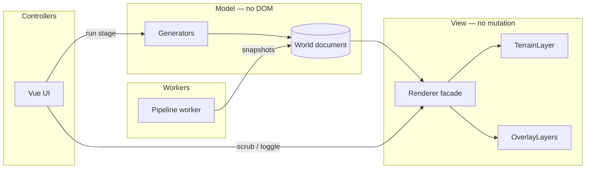

# World Builder — map display research

How to turn generated **world document** data into an interactive, layerable, animatable map viewport that runs in a **desktop shell** and in a **static GitHub Pages SPA**.

- **Decision (chosen stack):** [ADR 0009 — World Builder map display stack](../../docs/adr/0009-world-builder-map-display-stack.md)
- Epic: [#293](https://github.com/enmaku/portfolio-site/issues/293)
- Glossary: [`../CONTEXT.md`](../CONTEXT.md)
- Related: [Dwarf Fortress terrain notes](./dwarf-fortress-terrain-notes.md)

## Chosen stack (summary)

See ADR 0009 for the authoritative record. In brief:

- **Architecture:** Azgaar-style separation — `core/` (pipeline + **world document**), `renderer/` (pure view), `app/` (Vue/Quasar UI).
- **Primary viewport:** PixiJS 8 + pixi-viewport; grid coordinates; composable overlay layers.
- **Erosion animation:** CPU pipeline snapshots → texture re-upload; preview grid during gen, full res on completion.
- **Deployment:** Tauri 2 desktop + lazy-loaded GitHub Pages SPA chunk; same Vite build.
- **Optional later:** Three.js 3D relief mode; separate PNG/SVG export renderers.

## Problem framing

World Builder is not a GIS app. Geography is a **custom grid of scalar fields** (elevation, temperature, rainfall, drainage, salinity) that derive biomes, hydrology, movement cost, and resource rasters. Simulation outputs add **vector-ish overlays**: river graph, **settlements**, **trade routes**, **factions**, **named regions**.

The viewport must:

1. **Render rasters** — colorized elevation/biome/climate/resource layers from `Float32Array` or similar grids.
2. **Composite vector overlays** — rivers, routes, borders, markers, labels; toggleable per layer.
3. **Pan and zoom** smoothly on large worlds (512²–4096² cells, TBD).
4. **Animate pipeline stages** — especially erosion/hydrology — at a speed that feels live, not a slideshow.
5. **Run everywhere** — Tauri/Electron desktop *and* static SPA on GitHub Pages (client-only, no server).
6. **Stay pure** — renderers read **world document** state; generators never touch the DOM (Azgaar pattern).

## How comparable systems display maps

### Azgaar's Fantasy Map Generator (closest peer)

**Data model:** Voronoi polygon mesh (`grid` + `pack`), not a square raster — but the *architecture* is the reference.

**Rendering today:**

| Layer | Technology | Notes |
| --- | --- | --- |
| Political, biomes, rivers, borders | **SVG** (D3-driven paths) | Mature; editing tools mutate SVG-backed state |
| Relief hill icons | Migrating to **Three.js WebGL** | Sprite atlas in WebGL canvas embedded in SVG via `foreignObject` |
| Future direction | **WebGL2 layer framework** | Per-layer compositing; renderer is pure view |

**Architecture (explicit in README):**

```
settings → generators → world data → renderer
UI → editors → world data → renderer
```

Four layers: **world data + styles** (state), **generators** (model), **editors** (controllers), **renderers** (view). Data layer has no logic; renderer never mutates world data.

**Takeaway for World Builder:** Adopt the separation. Our rasters are grids not Voronoi, so base terrain is texture/upload not SVG paths — but political overlays, routes, and markers fit the same overlay-layer model.

### Watabou generators (Perilous Shores, city gen)

**Stack:** Haxe + OpenFL (Flash-style display list), not browser-native.

**Rendering:** Single imperative draw API for screen; **separate code path** for SVG export. Watabou explicitly rejected "browser-only SVG" because it would block reusing the same code in a **native desktop** build without a browser shell.

**Takeaway:** A **shared web renderer** (Canvas/WebGL in Vue) wrapped by Tauri for desktop avoids Watabou's dual-implementation trap. Export-to-SVG/PNG can be a *second* renderer target, not the primary view.

### Dwarf Fortress

**World map:** Tile-based 2D grid; ASCII or simplified tile graphics. World gen produces fields and derived features; the **regional map** is a discrete tile view, not a continuous mesh.

**Takeaway:** Grid-native display is natural for our **scalar field** pipeline. DF does not animate erosion for the user — we have an opportunity to show stage progression.

### Martin O'Leary / Amit Patel lineage (Azgaar's inspiration)

- Heightmap → **hypsometric tint** on a grid (Canvas or image).
- Rivers as **polyline overlays** on top.
- Polygon/Voronoi variants use **centroid coloring** per cell.

These are algorithm papers with minimal UI — but they confirm: **raster base + vector overlays** is the standard pattern for procedural fantasy terrain.

### GPU erosion demos (visual reference, not our sim)

Projects like [Webgl-Erosion](https://github.com/LanLou123/Webgl-Erosion), [hydraulic-erosion](https://github.com/tessapower/hydraulic-erosion), and [WebGPU-Erosion-Simulation](https://github.com/GPU-Gang/WebGPU-Erosion-Simulation) animate terrain by **ping-ponging height/sediment textures** in fragment shaders at 60fps.

**Takeaway:** Full GPU erosion sim is overkill for World Builder's *correctness* (we want DF-style post-process erosion on CPU, deterministic, seed-driven). But the **display technique** — upload height field to GPU texture, shade in fragment shader, swap textures each step — is exactly how to animate our CPU pipeline output smoothly.

## What does *not* fit as the primary renderer

| Tool | Why skip as primary |
| --- | --- |
| **Leaflet / MapLibre GL** | Built for Earth CRS (WGS84, tiles, MVT). Can hack **image coordinates** (`L.CRS.Simple`) but awkward for live raster regeneration; adds ~200KB+ for geo features we won't use. |
| **deck.gl** | Excellent for millions of points/lines on a *base map* — still needs something else to draw the terrain raster. Good as an optional overlay engine only. |
| **D3 SVG (whole map)** | Azgaar uses this for Voronoi cells; fine for thousands of polygons, poor for per-frame raster updates (erosion animation). Keep SVG/Canvas2D for *export*, not live sim view. |
| **Cesium / globe engines** | Planetary scale; wrong abstraction for continental fantasy grids. |

Leaflet + Pixi overlay *can* work for **static PNG + interactive markers** (see [leaflet-pixi-draw](https://github.com/maoz/leaflet-pixi-draw)) — useful for a "published map" read-only mode, not the generation viewport.

## Library candidates

### Tier 1 — Recommended stack

#### PixiJS 8 + pixi-viewport

**Role:** Primary 2D map viewport — pan, zoom, pinch, wheel; composable display layers.

| Requirement | Fit |
| --- | --- |
| Raster terrain | `Sprite` from `Texture` / `RenderTexture`; upload grid as `ImageData` or raw RGBA buffer each frame |
| Animated erosion | Re-texture sprite each pipeline step; 512²–1024² at 30–60fps is realistic on WebGL |
| Markers / routes | `Graphics` (polylines, circles), `Container` hierarchies, sprite icons for settlements |
| Layer toggles | Separate containers per overlay; show/hide |
| Web + desktop | Pure browser API; identical in Tauri webview and GitHub Pages |
| Vue 3 | [vue3-pixi](https://github.com/hairyf/vue3-pixi) or imperative `Application` in a composable |
| Bundle | Tree-shakeable imports; **lazy-load** on world-builder route (~150–250KB gzip depending on imports) |

**Layer sketch:**

```
Viewport (pan/zoom)
├── TerrainLayer      — Sprite, shader or pre-colored RGBA from elevation+biome
├── HydrologyLayer    — Graphics polylines (rivers)
├── LogisticsLayer    — movement cost tint (optional), haul corridors
├── SettlementLayer   — markers scaled by tier
├── RouteLayer        — trade route edges
├── FactionLayer      — border polygons / filled regions
└── LabelLayer        — Text (settlement names, regions)
```

#### Web Workers + OffscreenCanvas (optional perf path)

Run generation in a worker; if `OffscreenCanvas` is available, do **low-res preview** rasterization off main thread during long pipeline runs. Fall back to main-thread Pixi upload on Safari gaps.

### Tier 2 — Strong alternatives / adjuncts

#### Canvas 2D (no library)

Simplest path: `putImageData` on a grid, CSS transform for pan/zoom (or hand-rolled camera).

| Pros | Cons |
| --- | --- |
| Zero deps, smallest bundle | Manual hit-testing, layer compositing, zoom deceleration |
| Fine for MVP vertical slice | Heavier CPU cost at 2048² for animated updates |
| Same API in desktop and web | Markers/routes need manual redraw |

**Verdict:** Good for **first spike** (seed → heightmap → colors); migrate to Pixi before building overlay-heavy UI.

#### Three.js (+ optional React Three Fiber)

**Role:** 3D heightmap relief view, dramatic erosion animation, "inspect terrain" mode.

| Requirement | Fit |
| --- | --- |
| Hypsometric 3D mesh | `PlaneGeometry` displaced by height texture |
| Erosion animation | Same ping-pong texture technique as GPU erosion demos |
| Markers | Sprites or instanced meshes at grid coordinates |
| Routes | `Line2` or tube geometry along path |

| Pros | Cons |
| --- | --- |
| Best visual impact for erosion | Larger bundle (~500KB+ if not tree-shaken) |
| Shader colormaps trivial | 2D political map mode is awkward (camera angle, labels) |
| Ecosystem (controls, postprocessing) | Overkill if primary UX is top-down 2D |

**Verdict:** Optional **"3D preview"** layer or export glamour shot — not the default GM map view.

#### regl / raw WebGL2

Maximum control for custom terrain shaders; lowest-level ping-pong buffers for erosion display.

**Verdict:** Use only if Pixi/Three bundle or abstraction becomes blocking — high implementation cost.

### Tier 3 — Niche / later

| Library | Use case |
| --- | --- |
| **@canvas-tile-engine/core** | Lightweight grid pan/zoom if Pixi feels heavy; less ecosystem for markers |
| **deck.gl** | If we ever have 100k+ settlement points with attribute-driven styling |
| **D3** | Path generation for export SVG; contour lines from raster |
| **Leaflet + pixi overlay** | Read-only "shared map link" embed with static raster base |

## Animating landmass erosion

World Builder erosion is a **deterministic CPU post-process** (see DF notes), not a real-time fluid sim. Display strategy:

### Mode A — Pipeline frame replay (recommended)

1. Generator yields **snapshots** after each erosion iteration (or every N steps): `{ elevation, stepIndex }`.
2. Renderer uploads snapshot to GPU texture, tints, displays.
3. `requestAnimationFrame` or fixed timestep playback; user can scrub timeline.

**Pros:** Display matches actual sim output; deterministic; works with pure CPU pipeline.

**Performance:** At 512² RGBA, upload is ~1MB/frame — fine at 10–30fps. For 2048², use **preview resolution** during animation, full res on completion.

### Mode B — Dual-resolution

- **Preview grid** (256² or 512²): animated live during generation.
- **Full grid**: computed in worker; single final upload when stage completes.

Matches user expectation ("watch the mountains wear down") without blocking on 4k texture uploads.

### Mode C — GPU cosmetic erosion (not recommended for v1)

Run a WebGL erosion shader *in parallel* for visuals while CPU sim runs — risks visual/sim divergence. Only consider if Mode A cannot hit framerate targets.

## Overlays: markers, routes, resources

All overlays share a **grid coordinate system**: cell `(x, y)` or normalized `[0,1]²`. Viewport transforms world ↔ screen.

| Overlay | Source in world document | Render approach |
| --- | --- | --- |
| **Settlements** | `{ x, y, tier, label }` | Icon sprite + hit area; size by tier |
| **Trade routes** | Graph edges `{ from, to, commodity? }` | Polyline following low movement-cost path (precomputed path points in document) |
| **Strategic resources** | Sparse nodes | Distinct marker glyph; tooltip on inspect |
| **Faction borders** | Region polygons or raster mask | Semi-transparent fill + stroke |
| **Named regions** | Contiguous biome clusters | Outline + label at centroid |
| **Resource rasters** | Salt, arable, timber grids | Second texture with alpha blend; toggle |

**Hit testing:** Pixi `eventMode` on markers; for raster inspect, reverse-project mouse to grid cell, sample field arrays in CPU (no need for GPU readback).

**Labels:** Pixi `Text` or BitmapText; declutter at low zoom (hide hamlet labels, show drain cities only).

## Desktop + web + GitHub Pages

### Shared codebase pattern

```
world-builder/
├── core/           # pure TS: pipeline, world document, no DOM
├── renderer/       # Pixi layers, no generation logic
└── app/            # Vue 3 + Quasar UI: panels, timeline, export
```

| Target | How |
| --- | --- |
| **Desktop** | Tauri 2 wraps `app/` dist — same Vite build as web ([Tauri frontend-independent](https://v2.tauri.app/)) |
| **GitHub Pages SPA** | Route or subpath in portfolio Quasar app, **lazy import** `@world-builder/app` chunk |
| **Offline** | Desktop: Tauri FS plugins; web: IndexedDB for world documents |

Epic #293 originally scoped **desktop-only** and excluded portfolio routes. Browser deployment is a **scope expansion** — still compatible if generation stays client-side and the renderer has no Node/native deps in web mode.

### GitHub Pages constraints

- Static assets only — all gen + render in browser ✓
- No WebAssembly threads unless COOP/COEP headers — check if we use SharedArrayBuffer in workers (GitHub Pages may not send COOP headers; prefer structured clone or copy unless we verify)
- Bundle size matters — lazy route + dynamic `import('pixi.js')`

### Quasar alignment

Portfolio site is Vue 3 + Quasar 2 + Vite. World Builder UI can share Quasar components (`QDrawer` layer panel, `QSlider` timeline scrubber) while map canvas lives in a dedicated `<div ref="mapHost">` with Pixi mounted imperatively (cleaner than fighting Quasar layout with a full declarative Pixi tree).

## Recommended architecture



**Renderer facade API (sketch):**

```ts
interface MapRenderer {
  mount(el: HTMLElement): Promise<void>
  setWorld(doc: WorldDocument): void
  setLayerVisible(id: LayerId, visible: boolean): void
  playStageAnimation(stage: 'erosion', snapshots: ElevationSnapshot[], fps?: number): Promise<void>
  projectGridToScreen(x: number, y: number): { x: number; y: number }
  onCellClick(cb: (cell: GridCell) => void): void
  destroy(): void
}
```

Export renderers (PNG/SVG) implement the same `WorldDocument` input — different backend, no shared Pixi dependency required.

## Evaluation matrix

| Option | Raster + animate | Overlays | Web+Desktop | Dev cost | Bundle | Verdict |
| --- | --- | --- | --- | --- | --- | --- |
| **PixiJS + pixi-viewport** | ★★★★ | ★★★★★ | ★★★★★ | Medium | Medium | **Primary** |
| Canvas 2D hand-rolled | ★★★ | ★★ | ★★★★★ | Low start, high finish | Tiny | Spike only |
| Three.js 3D | ★★★★★ | ★★★ | ★★★★★ | High | Large | Optional 3D mode |
| Azgaar-style SVG | ★ | ★★★★ | ★★★★★ | High for rasters | Small | Export target |
| Leaflet/MapLibre | ★★ | ★★★★ | ★★★★★ | Medium | Large | Wrong CRS |
| regl custom | ★★★★★ | ★★ | ★★★★★ | Very high | Small | Escape hatch |

## Suggested spikes (ordered)

1. **Canvas or Pixi vertical slice** — fixture `Float32Array` elevation → hypsometric colors → pan/zoom. No Quasar yet.
2. **Snapshot animation** — 20-frame fake erosion sequence; measure fps at 512² and 1024².
3. **Overlay layer** — 50 settlements + 10 route polylines + click inspect cell.
4. **Worker handoff** — pipeline in worker, postMessage snapshots, renderer consumes.
5. **Tauri shell** — same `dist/` as `quasar build` subset; confirm webview parity.
6. **(Optional) Three.js relief** — same height texture; compare bundle and UX.

## Still open (not covered by ADR 0009)

1. **Grid size vs preview size** during animation — document in world schema?
2. **Portfolio route vs separate deploy** — lazy chunk in SPA vs standalone app.
3. **Export pipeline** — client-side canvas `toBlob` vs headless SVG generator sharing color maps.
4. **Coordinate system contract** — cell centers vs corners; affects marker placement and river graph alignment.

## References

- [Azgaar FMG README — architecture layers](https://github.com/Azgaar/Fantasy-Map-Generator/blob/master/README.md)
- [Azgaar FMG data model wiki](https://github.com/Azgaar/Fantasy-Map-Generator/wiki/Data-model-(in-progress))
- [Azgaar relief WebGL PR #1352](https://github.com/Azgaar/Fantasy-Map-Generator/pull/1352)
- [Watabou — SVG vs OpenFL discussion](https://watabou.itch.io/medieval-fantasy-city-generator/devlog/85275/070-districts)
- [Martin O'Leary — Generating fantasy maps](https://mewo2.com/notes/terrain)
- [PixiJS 8 Application docs](https://pixijs.download/dev/docs/app.Application.html)
- [pixi-viewport](https://github.com/pixijs-userland/pixi-viewport)
- [vue3-pixi](https://github.com/hairyf/vue3-pixi)
- [Webgl-Erosion — GPU texture ping-pong](https://github.com/LanLou123/Webgl-Erosion)
- [canvas-tile-engine](https://github.com/enesyukselx/canvas-tile-engine)
- [Tauri 2 — frontend independent](https://v2.tauri.app/)
